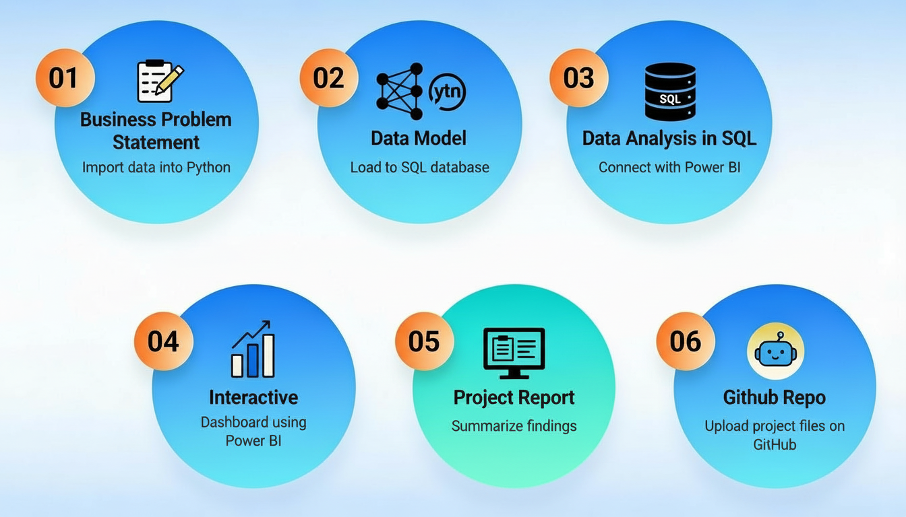
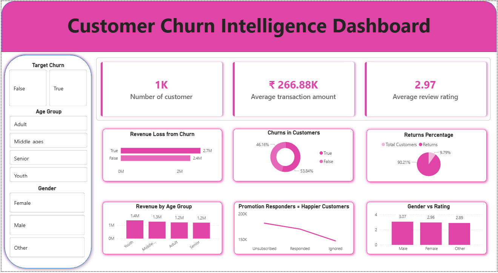

Below is a complete, ready‑to‑use `README.md` for your GitHub repo. You can edit your name, links, and screenshots as needed.[1][2]

***

# Customer Churn Intelligence Dashboard

An end‑to‑end data analytics project analyzing customer churn for an online retail business using **Python**, **MySQL**, and **Power BI**. The project identifies high‑risk customer segments, quantifies revenue lost to churn, and presents insights through an interactive dashboard with actionable business recommendations.[2][1]

***

## 📌 Project Overview

This project uses an **Online Retail Customer Churn** dataset of **1,000 customers** with demographic, transactional, and behavioral features.[1]
The goal is to answer key business questions such as:

- How much revenue is generated by churned vs active customers?  
- Which ages, segments, and behaviors are most associated with churn?  
- Which high‑value customers are at the highest risk?  
- How can the company prioritize retention actions?

The final output is a **Customer Churn Intelligence Dashboard** that helps stakeholders monitor churn, explore segments, and plan interventions.[2]

***

## 🗂 Dataset

- File: `online_retail_customer_churn.csv`  
- Rows: **1,000** customers  
- Key columns:[1]
  - `Customer_ID`, `Age`, `Gender`, `Annual_Income`  
  - `Total_Spend`, `Years_as_Customer`, `Last_Year_Purchases`  
  - `Average_Transaction_Amount`, `Num_of_Returns`, `Num_of_Support_Contacts`  
  - `Satisfaction_Score`, `Last_Purchase_Days_Ago`  
  - `Email_Opt_In`, `Promotion_Response`, `Age_Group`, `Target_Churn`  

Target variable: **`Target_Churn`** (1 = churned, 0 = active).[1]

---

## 🔄 End‑to‑End Workflow

1. **Data Loading & EDA (Python)**
   - Load CSV with `pandas`.
   - Explore structure using `.head()`, `.info()`, `.describe()`.[1]
2. **Data Cleaning & Feature Engineering**
   - Validate data types, check for missing values and outliers.
   - Create `age_group` (Youth, Adult, Senior) and value segments based on `total_spend`.[1]
3. **Load to MySQL**
   - Create database `customer` and table `mytable`.
   - Push cleaned dataframe from Python to MySQL using SQLAlchemy.
4. **SQL Analysis (10 Business Questions)**
   - Write and run advanced queries (CTEs, window functions) to understand churn behavior.[2]
5. **Power BI Dashboard**
   - Connect Power BI to MySQL.
   - Build visuals for revenue impact, churn segments, behavior patterns, and high‑risk customers.
6. **Insights & Recommendations**
   - Summarize key findings and propose retention strategies.

***

## 📊 Power BI Dashboard

The **Customer Churn Intelligence Dashboard** includes:

- **Revenue by Churn** – column chart comparing total revenue and average spend for churned vs active customers.[2]
- **Age vs Churn Bubble Plot** – high‑risk ages (e.g., 19 and 62 years) with high returns and churn percentages.[2]
- **Customer Value Donut** – distribution of Low / Medium / High value customers and their churn rates.[2]
- **Inactive > 90 Days Matrix** – churn by gender for long‑inactive customers.[2]
- **Top 5 High‑Income Churners Table** – list of VIP customers who churned despite above‑average spending.[2]

You can open `Customer_Churn_Dashboard.pbix` (if included) in Power BI Desktop and reconnect to your MySQL instance.

***

## ✅ Tech Stack

- **Language**: Python (Pandas, NumPy)[1]
- **Database**: MySQL 8  
- **Visualization**: Power BI Desktop  
- **Other**: SQLAlchemy, Jupyter Notebook, Git/GitHub

***

## 📚 Learning Outcomes

Through this project you can demonstrate:

- Practical experience with **data cleaning and feature engineering** in Python.[1]
- Strong **SQL skills**: aggregation, CASE logic, CTEs, window functions.[2]
- Ability to build a **business‑focused BI dashboard** and tell a clear data story.  
- Understanding of **customer churn, segmentation, and retention strategies**.

***

## 🙋‍♂️ Contact

Feel free to reach out with feedback or collaboration ideas:

- **Name**: *K.Harinath*  
- **LinkedIn**: *https://www.linkedin.com/in/harinathkurapati/*  
- **Email**: *kurapatiharinath5@gmail.com*  

If you find this project useful, consider ⭐ starring the repo!
